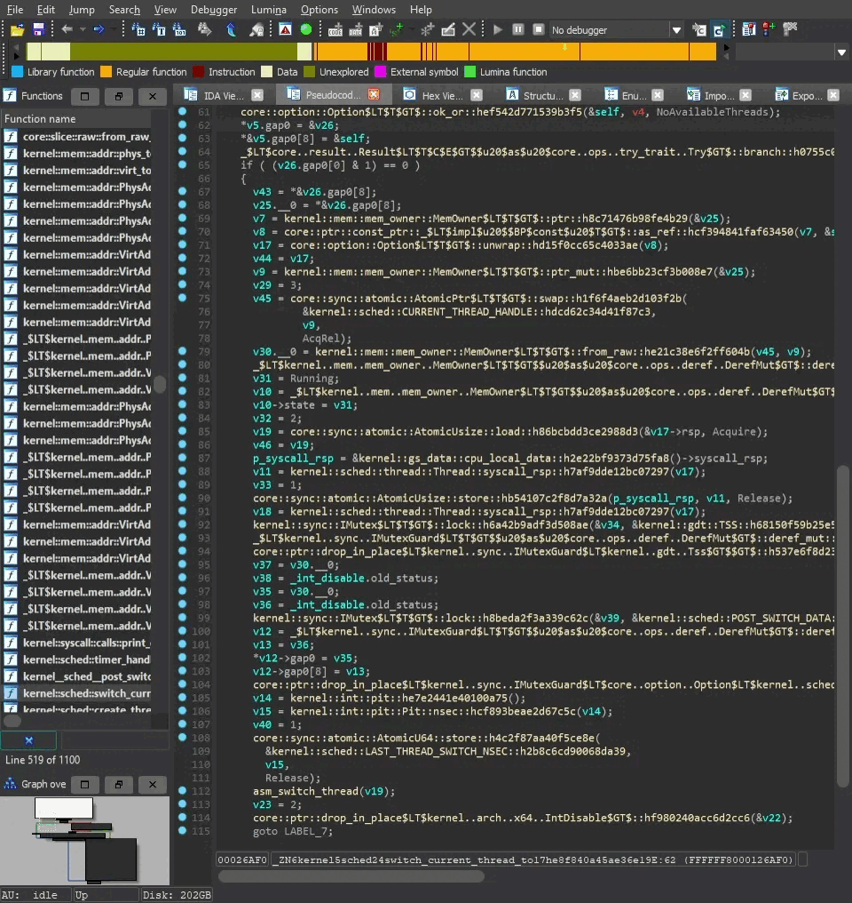

# IDA Rust Demangler

This project provides a script that demangles Rust function names and normalize it for [IDA](https://www.hex-rays.com/ida-pro/), making it easier to read and understand the code.

# Requirements

- Python 3.x
- IDA Pro 7.x or later

# Dependencies

The demangling algorithm used in this script is based on [rs-dml](https://github.com/timetravelthree/FTLRustDemangler) binary so make sure you have it already installed.

# Installation

Installing the plugin is a straightforward process. Simply copy the contents of the `plugin/` directory (excluding the directory itself) to the IDA plugins directory. To obtain the IDA plugins directory, you can use this Python function: `idaapi.get_ida_subdirs("plugins")` in the "IDA Python interactive shell".

# Usage

1. Open the Rust binary file in IDA Pro.
1. Run the script by clicking on Edit > Plugins > IDA Rust Demangler.

# Contributing
Contributions are welcome! If you find a bug or have a feature request, please open an issue or submit a pull request.

# License
This project is licensed under the GPL-2.0 License - see the LICENSE file for details.

